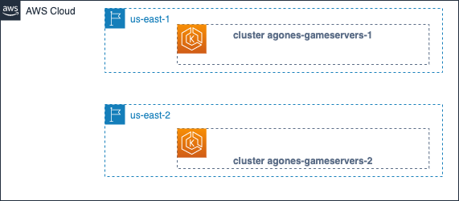
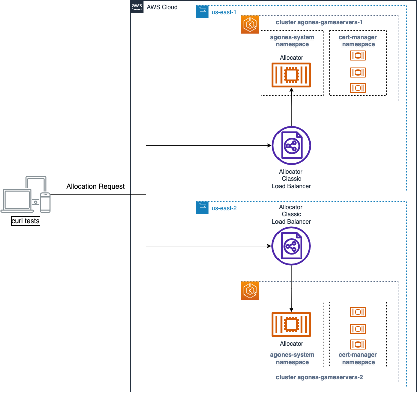
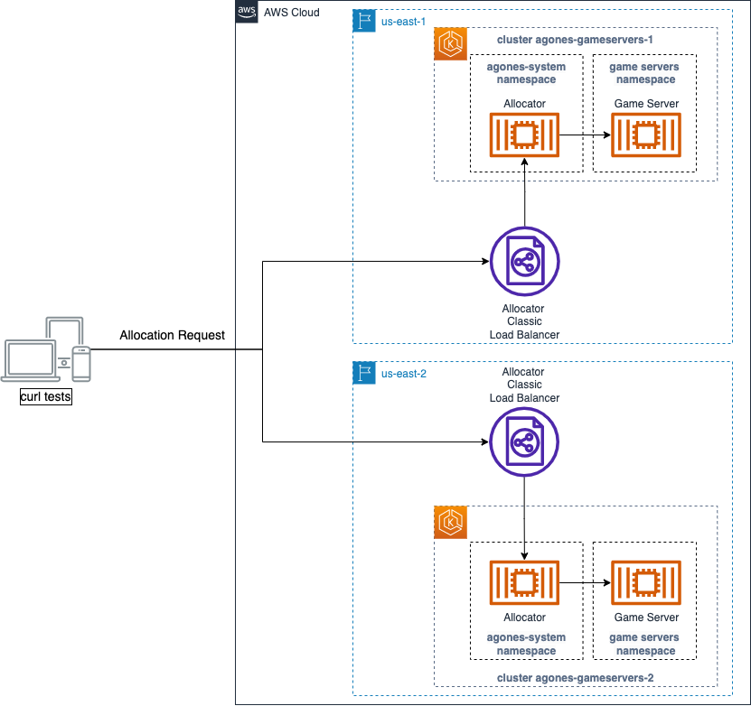
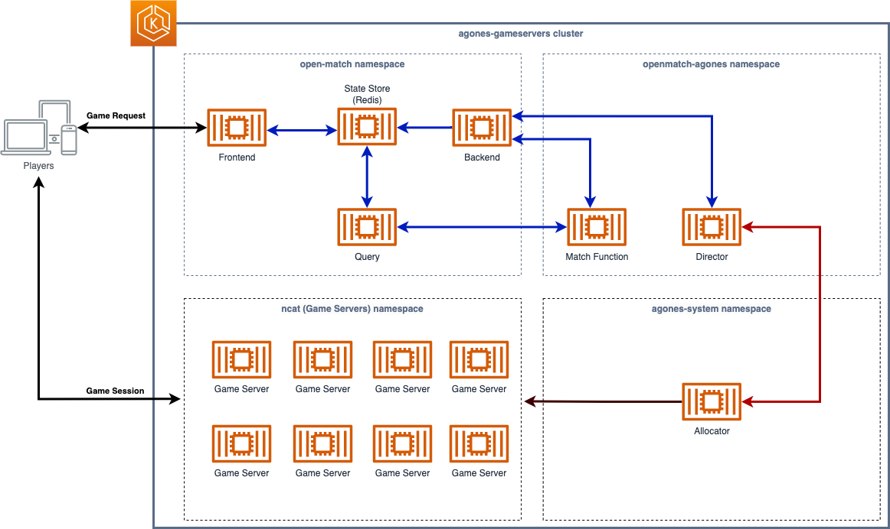

# Guidance for Game Server Hosting on Amazon EKS with Agones and Open Match


[[_TOC_]]

## Objectives

The goal is to build a modular end-to-end solution that implements all the required components for open source, Kubernetes based game server hosting for a session-based multiplayer game. This includes the whole flow from the game client (Unity, Unreal or C++) authenticated against a backend, all the way to game servers running in multiple locations globally.

The purpose of the solution is to address the common customer requirement of having an open source based fully configurable solution that can fully run on your local system and can be deployed across location within and outside of AWS.


## Disclaimer
- *We are currently at the development stage of the project and the steps described below are experimental. Please do not use them for production workloads.*
- The steps below have been tested with EKS 1.22/1.23 and cert-manager 1.8.0/1.11.0

## Pre-requisites
This document assumes the user already has access to an AWS account and has the [AWS command line interface](https://docs.aws.amazon.com/cli/latest/userguide/getting-started-install.html) installed and configured to access the account using their credentials. 
While the commands and scripts here were tested on `bash` and `zsh` shells, they can be run with some modifications in other shells, like `Windows PowerShell`.

To deploy the infrastructure and run the examples with pre-built images, please
- Install [kubectl](https://kubernetes.io/docs/tasks/tools/#kubectl)
- Install [eksctl](https://docs.aws.amazon.com/eks/latest/userguide/eksctl.html)
- Install [Helm](https://helm.sh/docs/intro/install/)
    ```bash
    curl -L https://git.io/get_helm.sh | bash -s -- --version v3.8.2
    ```
- Install [Terraform](https://developer.hashicorp.com/terraform/tutorials/aws-get-started/install-cli)

- Additionally, if you want to build your versions of the tools used here, please
- Install [Go](https://go.dev/doc/install)
- Install [Docker](https://docs.docker.com/get-docker/)

## Create two EKS clusters to host containerized game servers

### Use Terraform to bootstrap the clusters and deploy the required components

Run the following commands to create a primary EKS cluster in us-east-1 and build a secondary cluster in us-east-2 for multi-cluster allocation. Additionaly, we configure the certificates that will be used to communicate with Agones.
```bash
# Create the first cluster
terraform -chdir=eks_clusters/cluster1 init
terraform -chdir=eks_clusters/cluster1 apply -auto-approve -var="cluster_name=agones-gameservers-1" -var="cluster_region=us-east-1"

# Create the second cluster
terraform -chdir=eks_clusters/cluster2 init
terraform -chdir=eks_clusters/cluster2 apply -auto-approve -var="cluster_name=agones-gameservers-2" -var="cluster_region=us-east-2" -var="ecr_region=us-east-1"

# Configure the TLS certificates for Agones
sh scripts/test-agones-tls.sh  agones-gameservers-1 us-east-1
sh scripts/test-agones-tls.sh  agones-gameservers-2 us-east-2
```
Note that you can customize the cluster_name and regions using the variables passed to the EKS cluster. 

Each cluster is maintained with its own terraform state file. The infrastructure definition for each cluster can be updated separately. Operators can reconfigure each of the clusters without impacting the entire solution. 


### About the clusters bootstrapping

The Terraform script creates a cluster using the [Amazon EKS Blueprints for Terraform](https://aws-ia.github.io/terraform-aws-eks-blueprints). Agones and Open Match are deployed when the clusters are bootstrapped.

Certificates CA and key files required for TLS communictions are generated by [certmanager](https://cert-manager.io). Certmanager is enabled in the Terraform definition as an add-on of the EKS blueprints.

The EKS Blueprints enables metrics and logging for the EKS clusters. Metrics are exported to CloudWatch to provide observability on the clusters. 

### Current state diagram
At the end of each section, we will show a diagram highlighting what we have built so far. At this moment we don't have much, just the initial clusters on their regions.



### Test the Agones deployment
To test if cert-manager and Agones are correctly deployed and configured, and if we can reach the [Agones Allocator Service](https://agones.dev/site/docs/advanced/allocator-service/), run this:

```bash
sh scripts/test-agones-tls.sh agones-gameservers-1 us-east-1
sh scripts/test-agones-tls.sh agones-gameservers-2 us-east-2
```
This code executes commands against the clusters to get the address of the Agones Allocator. It executes the `curl` command to call the service using the certificate, key and CA files created during the deployment of Agones. 

You should see a message like this for each cluster:
```
Updated context "arn:aws:eks:us-east-1:xxxxxxxxxxxxxx:cluster/agones-gameservers-1 in <local user path>/.kube/config".
{"code":8, "message":"there is no available GameServer to allocate", "details":[]}
```
This is the Agones Allocator answering that it can't allocate any game server. That's the expected behavior, since we didn't deploy any game server yet.
If you run this test shortly after deploying the EKS cluster, you may receive one or two messages like:
```bash
curl: (6) Could not resolve host: xxxxxxxxxxxxxxx-yyyyyyyyy.us-east-x.elb.amazonaws.com
```
That's because the DNS propagation has not reached your DNS servers. Wait one or two minutes before executing the command again.

If you receive a different message, add ` --verbose` to the end of the `curl` command and examine the output.

### Current state diagram


Now our main components (Agones, Open Match) are deployed. Cert-manager was configured to provide TLS certificates. We tested TLS communications and confirmed we can send requests to the allocator service using TLS. 

Note: since we will be focusing on the game allocation and matchmaking aspects of this repository, we will omit cert-manager kubernetes deployments from the next diagrams. We will focus on the relevant kubernetes objects only (for example, the agones-system namespace also has `controller` and `ping` pods, not shown here).

## Build, deploy and test the game server fleets

We added two game servers to test the Agones and Open Match deployments: 
- ncat-server: a lightweight client-server chatroom we developed using [Ncat](https://nmap.org/ncat/) together with a Golang client to illustrate the Open Match integration.
- [SuperTuxKart](https://supertuxkart.net/Main_Page): a 3D open-source kart racing game developed in C/C++. Since we didn't change the client's code to integrate Open Match functionality, we use a Golang wrapper with the code from the ncat example.

You can deploy either server to the clusters to test the Agones operation. Later, we will use these deployments to test the Open Match matchmaking. For simplicity, we will use the ncat deployment in our examples.

The commands below build the image, push it to your ECR repository, and use it to deploy 4 fleets of ncat game servers on each cluster. It uses the value of each `AWS_REGION` where the cluster is located to tag the fleets, which we will use later when allocating game servers depending on the region they are located:

```bash
sh scripts/deploy-test-fleets.sh agones-gameservers-1 us-east-1 agones-gameservers-2 us-east-2
```
> **About the ncat and supertuxkart fleet files:** These files deploy the [Agones Fleet](https://agones.dev/site/docs/reference/fleet/) CRDs. A `Fleet` is a set of warm `GameServers` that are available to be allocated from. You can inspect the content of the files on the folders [./fleets/ncat](./fleets/ncat) and [./fleets/stk](./fleets/stk).

#### Testing
In addition to the `kubectl get fleets` and `kubectl get gameservers` commands to verify the status of the fleets and game servers, we can test the Allocator Service with `curl`, in a way similar to what we did after the deployment of the clusters.  
Let's run the updated test code below:

```bash
# We will be testing the allocation to the servers on the gameservers namespace
sh  scripts/test-gameserver-allocation.sh agones-gameservers-1 us-east-1
sh  scripts/test-gameserver-allocation.sh agones-gameservers-2 us-east-2
```
You should see a similar result for each cluster:
```bash
Updated context "arn:aws:eks:us-east-1:xxxxxxxxxxxxxx:cluster/agones-gameservers-1 in <local user path>/.kube/config".
- Allocating server -
{"gameServerName":"ncat-pool2-zr5xn-nc9cz","ports":[{"name":"default","port":7256}],"address":"ec2-3-84-182-165.compute-1.amazonaws.com","nodeName":"ip-192-168-7-36.ec2.internal"}

- Display game servers -
NAME                     STATE       ADDRESS                                    PORT   NODE                           AGE     LABELS
ncat-pool2-zr5xn-nc9cz   Allocated   ec2-3-84-182-165.compute-1.amazonaws.com   7256   ip-192-168-7-36.ec2.internal   2m9s    agones.dev/fleet=ncat-pool2,agones.dev/gameserverset=ncat-pool2-zr5xn,pool=TWO,region=us-east-1
... Removed unallocated servers ...

Switched to context "xxxxxxxxxxxxxxxx@agones-gameservers-2.us-east-2.eksctl.io".
- Allocating server -
{"gameServerName":"ncat-pool3-qwgcq-p8ntr","ports":[{"name":"default","port":7403}],"address":"ec2-3-143-205-47.us-east-2.compute.amazonaws.com","nodeName":"ip-192-168-37-221.us-east-2.compute.internal"}

- Display game servers -
NAME                     STATE       ADDRESS                                            PORT   NODE                                           AGE    LABELS
ncat-pool3-qwgcq-p8ntr   Allocated   ec2-3-143-205-47.us-east-2.compute.amazonaws.com   7403   ip-192-168-37-221.us-east-2.compute.internal   115s   agones.dev/fleet=ncat-pool3,agones.dev/gameserverset=ncat-pool3-qwgcq,pool=THREE,region=us-east-2
... Removed unallocated servers ...
```
Observe that the server address returned by the `curl` command is the same that appears as `Allocated` on the `kubectl get gameservers` output.

### Current state diagram


With the game servers deployed, we put the allocator to work, answering our allocation requests with the IP of the allocated server on the same cluster, and marking it as `Allocated`.

## Setup and test multi-cluster allocation
In the previous test, we did a local allocation request to each cluster, and received a game server allocated in the same cluster. [Multi-cluster Allocation](https://agones.dev/site/docs/advanced/multi-cluster-allocation/) enables Agones to allocate game servers in other Agones clusters. To request a multi-cluster allocation, we simply add `"multiClusterSetting":{"enabled":true}` to the `curl --data` payload of the test we already used, as in the code below. Please, try it:
```bash
sh scripts/test-gameserver-multicluster-allocation.sh agones-gameservers-1 us-east-1
```
It seems we are not ready yet, Agones does not like it and complains two times with.
```bash
{"error":"no multi-cluster allocation policy is specified","code":2,"message":"no multi-cluster allocation policy is specified"}
```
So, let's configure the multi-cluster policy. We will do this on the `agones-gameservers-1`, since it will be our "home" or "router" cluster, that will accept allocations to itself and to `agones-gameservers-2`.

1. Store the addresses of the Agones allocators for both clusters. We will need this in our policies:

```bash
export CLUSTER1=agones-gameservers-1
export CLUSTER2=agones-gameservers-2
export ALLOCATOR_IP_CLUSTER1=$(sh scripts/set-allocator-ip.sh ${CLUSTER1} us-east-1)
export ALLOCATOR_IP_CLUSTER2=$(sh scripts/set-allocator-ip.sh ${CLUSTER2} us-east-2)
```

2. Switch the kubernetes context to `agones-gameservers-1`:
```bash
export CLUSTER_NAME="agones-gameservers-1"
export AWS_REGION="us-east-1"
kubectl config use-context $(kubectl config get-contexts -o=name | grep ${CLUSTER_NAME})
```

3. Creating the multi-cluster policies

To enable Agones multi-cluster configuration, we use the [GameServerAllocationPolicy](https://agones.dev/site/docs/reference/agones_crd_api_reference/#multicluster.agones.dev/v1.GameServerAllocationPolicy). We need to define a policy for each cluster used to allocate game servers, including the local cluster.
First, let's take a look at the multi-cluster configuration files:

***multicluster-allocation-1.yaml***
```yaml
# Configures local multi-cluster allocation on agones-gameservers-1
apiVersion: multicluster.agones.dev/v1
kind: GameServerAllocationPolicy
metadata:
  name: allocator-policy-to-local-cluster
  namespace: agones-system
spec:
  connectionInfo:
    clusterName: "agones-gameservers-1"
    namespace: gameservers
  priority: 1
  weight: 100
```
***multicluster-allocation-1-to-2.yaml***
```yaml
# Configures remote multi-cluster allocation from agones-gameservers-1 to agones-gameservers-2
apiVersion: multicluster.agones.dev/v1
kind: GameServerAllocationPolicy
metadata:
  name: allocator-policy-to-cluster-2
  namespace: agones-system
spec:
  connectionInfo:
    allocationEndpoints:
    - ${ALLOCATOR_IP_CLUSTER_2}
    clusterName: "agones-gameservers-2"
    namespace: gameservers
    secretName: allocator-secret-to-cluster-2 
  priority: 1
  weight: 100
```
Notes:
- The policy for the local cluster doesn't have a `spec.connectionInfo.allocationEndpoints` field. 
- On the remote cluster file, we will use `envsubst` to import the value of the variables `${ALLOCATOR_IP_CLUSTER_2}`, to the `spec.connectionInfo.allocationEndpoints`.
- `spec.connectionInfo.namespace` contains the namespace where the game servers are running in the target clusters. The Namespace specified in the allocation request (like in the `curl` tests) is used to refer to the namespace that the GameServerAllocationPolicy itself is located in, `agones-system` in our case.
- `spec.connectionInfo.secretName` points to a secret that holds the cert, key and ca of the **target** cluster. We will create this secret in the next step.
- Game servers will be allocated from clusters with the lowest priority number. If there are no available game servers available in clusters with the lowest priority number, they will be allocated from clusters with the next lowest priority number. 
- For clusters with the same priority, the cluster is chosen with a probability relative to its weight.

To create the policies, run:
```bash
kubectl apply -f multicluster-allocation-1.yaml
envsubst < multicluster-allocation-1-to-2.yaml | kubectl apply -f -
```

4. Establish a certificate trust between both clusters
To accept allocation requests from other clusters, Agones' allocator for cluster `agones-gameservers-2` should accept the client’s certificate from cluster `agones-gameservers-1` and the cluster `agones-gameservers-1`’s client should be configured to accept the server TLS certificate, if it is not signed by a public Certificate Authority (CA). You can read more about this process on the [Establish trust](https://agones.dev/site/docs/advanced/multi-cluster-allocation/#establish-trust) section of the Multi-cluster Allocation documentation.

To configure `agones-gameservers-1` trust certs, run:
```bash
kubectl create secret generic \
--from-file=tls.crt=client_agones-gameservers-2.crt \
--from-file=tls.key=client_agones-gameservers-2.key \
--from-file=ca.crt=ca_agones-gameservers-2.crt \
allocator-secret-to-cluster-2 -n agones-system
```
This will create the secret `allocator-secret-to-cluster-2` in the `agones-system` namespace:
```yaml
apiVersion: v1
data:
  ca.crt:  <REDACTED>
  tls.crt: <REDACTED>
  tls.key: <REDACTED>
kind: Secret
metadata:
  name: allocator-secret-to-cluster-2
  namespace: agones-system
type: Opaque
```

5. Test multi-cluster allocation from cluster 1 to cluster 2

First, let's delete all game servers on both clusters, so we remove the already allocated game servers, and have a clearer output on our test. Agones fleets will recreate the deleted game servers and leave all on Ready state:
```bash                                                    
for context in $(kubectl config get-contexts -o=name | grep agones-gameservers);
do
    kubectl config use-context $context
    kubectl delete --all gs -n gameservers
done
```

Now, we can test the policies with the updated code below:
```bash
sh scripts/test-gameserver-multicluster-allocation.sh agones-gameservers-1 us-east-1
sh scripts/test-gameserver-multicluster-allocation.sh agones-gameservers-2 us-east-2
```
And we receive an output similar to this for each cluster:
```bash
Switched to context "xxxxxxxx@agones-gameservers-1.us-east-1.eksctl.io".
- Allocating server -
{"gameServerName":"ncat-pool3-qwgcq-mtwf7","ports":[{"name":"default","port":7334}],"address":"ec2-3-143-205-47.us-east-2.compute.amazonaws.com","nodeName":"ip-192-168-37-221.us-east-2.compute.internal"}
- Display ALLOCATED game servers only -

Switched to context "xxxxxxxx@agones-gameservers-2.us-east-2.eksctl.io".
- Allocating server -
{"error":"no multi-cluster allocation policy is specified","code":2,"message":"no multi-cluster allocation policy is specified"}
- Display ALLOCATED game servers only -
ncat-pool3-qwgcq-mtwf7   Allocated   ec2-3-143-205-47.us-east-2.compute.amazonaws.com   7334   ip-192-168-37-221.us-east-2.compute.internal   14s
```
Please observe the sequence on the example above:
- The script switches to the first cluster
- Request the allocation to the first cluster endpoint, that is successful and show one allocated game server
- List the allocated game servers on the first cluster, showing none 
- The script Switches to the second cluster
- Request the allocation to the second cluster endpoint, that will fail because we didn't configure multi-cluster allocation and trust on the second cluster yet
- List the allocated game servers on the first cluster, showing one server

Your output may show the game server allocated to the first cluster, because we are using the same `priority` and `weight` on our allocation policies, you have 50% chance of the game server being allocated on each cluster. Please, repeat the tests a few more times, you should see game servers being randomly allocated to each cluster.

### Current state diagram


## Integrate Open Match with Agones
The image below shows the typical configuration of Open Match.
*Open Match diagram from [Matchmaking using Open Match](https://open-match.dev/site/docs/guides/matchmaker/)*

The core Open Match Services are deployed to the `open-match` namespace. We will add customizations and external services to the cluster to integrate Open Match and Agones. Both components will communicate to handle whole matchmaking and game server allocation.

For simplicity, we bypass the `Game Frontend`, that could handle tasks like user authentication, leaderboards, and chat. We use a `Game Client` that connects directly to Open Match's `Frontend`. We deploy customized versions of the `Match Function` and the `Director` that are using the latency between the client and the game server to match players. Players with similar latencies are matched and the Agones allocator allocates a gameserver in the region with the lower latency.

*Open Match - Agones matchmaking and game server allocation flow*

The diagram above shows our matchmaking and allocation process:
1. The client request a game session
2. Open Match processes the request from multiple clients, matching them based on their latencies to the game servers regions, and asks Agones for a game server allocation
3. Agones allocates a game server on the cluster closest to the clients and returns its address to Open Match (remote clusters not shown on the diagram)
4. The client receives the game server address from Open Match and initiates a game session with the server 

In the diagram, the blue arrows show the standard Open Match flow, explained on [Matchmaking using Open Match](https://open-match.dev/site/docs/guides/matchmaker/). Our integration explained on this current section shows the tasks needed to enable the red arrow between Open Match Director and Agones Allocator.


### Deploying Director and Match Function on cluster 1
This repository contains code and documentation for the customized versions of Open Match `director` and `matchfunction` on the folders [./integration/director/](./integration/director/) and [./integration/matchfunction/](./integration/matchfunction/), as well as the client tools we used in the folder [./integration/clients/](./integration/clients/). Please, refer to the documentation on each folder for more details about them.

We will deploy and test the customizations to the cluster 1.

1. Switch the kubernetes context to `agones-gameservers-1`
```bash
export CLUSTER_NAME="agones-gameservers-1"
export AWS_REGION="us-east-1"
kubectl config use-context $(kubectl config get-contexts -o=name | grep ${CLUSTER_NAME})
```

2. Deploy the Open Match matchmaking function

```bash
sh scripts/deploy-matchfunction.sh agones-gameservers-1 us-east-1
```

3. Deploy the Open Match Director

```bash
sh scripts/deploy-director.sh agones-gameservers-1 us-east-1
```

4. Verify that the mmf and director pods are running
```bash
kubectl get pods -n agones-openmatch
```
5. Check the logs

**director**

```bash
kubectl logs -n agones-openmatch  -l app=agones-openmatch-director
```
```bash
...
YYYY/MM/DD hh:mm:ss Generated 0 matches for profile profile_double_arg:"latency-us-east-2" max:25
YYYY/MM/DD hh:mm:ss Generated 0 matches for profile profile_double_arg:"latency-us-west-2" max:100 min:75
YYYY/MM/DD hh:mm:ss Generated 0 matches for profile profile_double_arg:"latency-us-east-2" max:50 min:25
YYYY/MM/DD hh:mm:ss Generated 0 matches for profile profile_double_arg:"latency-us-east-1" max:50 min:25
YYYY/MM/DD hh:mm:ss Generated 0 matches for profile profile_double_arg:"latency-us-west-1" max:25
...
```
**mmf**
```bash
kubectl logs -n agones-openmatch -l app=agones-openmatch-mmf
```
```bash
...
YYYY/MM/DD hh:mm:ss Generating proposals for function profile_double_arg:"latency-us-west-2" max:100 min:75
YYYY/MM/DD hh:mm:ss Generating proposals for function profile_double_arg:"latency-us-east-1" max:25
YYYY/MM/DD hh:mm:ss Generating proposals for function profile_double_arg:"latency-us-west-1" max:100 min:75
YYYY/MM/DD hh:mm:ss Generating proposals for function profile_double_arg:"latency-us-west-2" max:50 min:25
YYYY/MM/DD hh:mm:ss Generating proposals for function profile_double_arg:"latency-us-east-1" max:25
...
```
In our example, `director` polls the `backend` service each 5 seconds, trying to fetch matches from it, and sends the match profiles to the `matchmaking function`. You can see more details about `FetchMatches` and `MatchProfile` on the [Director page at Open Match site](https://open-match.dev/site/docs/guides/matchmaker/director/).  The logs on the `mmf` pod are from connections made by the `director`, if the latter gets undeployed or scaled to 0, `mmf` will stop logging.


### Accessing the ncat server
Here we test the flow of the Open Match - Agones integration. We use the ncat fleet deployment and the contents of the folder [integration/ncat/client](integration/ncat/client). You will need to open several terminal windows to run this test. You can find a demo of this test in the [Visuals](#visuals) section.

1. Ensure that the ncat game servers are running, and you have at least one game server in the `Ready` state in one of our clusters (since `director` already has the multi-cluster allocation configured, even if we request a game server to Open Match running on cluster 1, Agones will still allocate a game server on either cluster).

```bash
for context in $(kubectl config get-contexts -o=name | grep agones-gameservers); 
do 
    kubectl config use-context $context
    CLUSTER_NAME=$(kubectl config view --minify -o jsonpath='{.clusters[].name}' | cut -f1 -d.)
    echo "- Display READY game servers on cluster ${CLUSTER_NAME} -"
    kubectl get gameservers --namespace ${GAMESERVER_NAMESPACE} | grep Ready
    echo
done
```

2. Get cluster 1 Frontend Load Balancer address, the TLS cert and run the player client
```bash
export CLUSTER_NAME="agones-gameservers-1"
export AWS_REGION="us-east-1"
kubectl config use-context $(kubectl config get-contexts -o=name | grep ${CLUSTER_NAME})
FRONTEND=$(kubectl get svc -n open-match open-match-frontend-loadbalancer -o jsonpath='{.status.loadBalancer.ingress[0].hostname}')
cd integration/clients/ncat
kubectl get secret open-match-tls-server -n open-match -o jsonpath="{.data.public\.cert}" | base64 -d > public.cert
kubectl get secret open-match-tls-server -n open-match -o jsonpath="{.data.private\.key}" | base64 -d > private.key
kubectl get secret open-match-tls-rootca -n open-match -o jsonpath="{.data.public\.cert}" | base64 -d > publicCA.cert
go run main.go -frontend $FRONTEND:50504  -latencyUsEast1 10 -latencyUsEast2 30
```
```bash
YYYY/MM/DD hh:mm:ss Connecting to Open Match Frontend
YYYY/MM/DD hh:mm:ss Ticket ID: cdfu6mqgqm6kj18qr880
YYYY/MM/DD hh:mm:ss Waiting for ticket assignment
```

3. In three other terminal windows, repeat the steps above. You should have a similar output to the sample below, showing the connection to the Frontend server, the game server assigned to the client and the connection to the game server:
```bash
YYYY/MM/DD hh:mm:ss Connecting to Open Match Frontend
YYYY/MM/DD hh:mm:ss Ticket ID: cdfu6mqgqm6kj18qr880
YYYY/MM/DD hh:mm:ss Waiting for ticket assignment
YYYY/MM/DD hh:mm:ss Ticket assignment: connection:"ec2-52-87-246-98.compute-1.amazonaws.com:7062"
YYYY/MM/DD hh:mm:ss Disconnecting from Open Match Frontend
ec2-52-87-246-98.compute-1.amazonaws.com:7062
YYYY/MM/DD hh:mm:ss Connecting to ncat server
<announce> 201.17.120.226 is connected as <user5>.
<announce> already connected: nobody.
<announce> 201.17.120.226 is connected as <user6>.
<announce> already connected: 201.17.120.226 as <user5>.
<announce> 201.17.120.226 is connected as <user7>.
<announce> already connected: 201.17.120.226 as <user5>, 201.17.120.226 as <user6>.
<announce> 201.17.120.226 is connected as <user8>.
<announce> already connected: 201.17.120.226 as <user5>, 201.17.120.226 as <user6>, 201.17.120.226 as <user7>.

```

6. In another terminal window, verify in which cluster our game server was `Allocated`, it should have the same address shown in the client windows.
```bash
NAMESPACE=gameservers
for context in $(kubectl config get-contexts -o=name | grep agones-gameservers); 
do 
    kubectl config use-context $context
    CLUSTER_NAME=$(kubectl config view --minify -o jsonpath='{.clusters[].name}' | cut -f1 -d.)
    echo "- Display ALLOCATED game servers on cluster ${CLUSTER_NAME} -"
    kubectl get gameservers --namespace ${NAMESPACE} | grep Allocated
    echo
done
```

7. Change the context to this cluster and verify the game servers. Let the command running with the `-w` flag to detect state changes.
```bash
kubectl get gs -n gameservers -w
NAME                     STATE       ADDRESS                                    PORT   NODE                            AGE
ncat-pool1-m72zl-7l6lp   Allocated   ec2-52-87-246-98.compute-1.amazonaws.com   7062   ip-192-168-4-119.ec2.internal   6m22s
ncat-pool1-m72zl-pdh5j   Ready       ec2-52-87-246-98.compute-1.amazonaws.com   7118   ip-192-168-4-119.ec2.internal   6m22s
ncat-pool2-klwnc-98ccx   Ready       ec2-52-87-246-98.compute-1.amazonaws.com   7198   ip-192-168-4-119.ec2.internal   6m21s
ncat-pool2-klwnc-9whl7   Ready       ec2-52-87-246-98.compute-1.amazonaws.com   7041   ip-192-168-4-119.ec2.internal   6m21s
ncat-pool3-pckx8-79v5h   Ready       ec2-52-87-246-98.compute-1.amazonaws.com   7144   ip-192-168-4-119.ec2.internal   6m20s
ncat-pool3-pckx8-jbqv5   Ready       ec2-52-87-246-98.compute-1.amazonaws.com   7684   ip-192-168-4-119.ec2.internal   6m20s
ncat-pool4-2vkzg-6xwqb   Ready       ec2-52-87-246-98.compute-1.amazonaws.com   7225   ip-192-168-4-119.ec2.internal   6m20s
ncat-pool4-2vkzg-l86t6   Ready       ec2-52-87-246-98.compute-1.amazonaws.com   7791   ip-192-168-4-119.ec2.internal   6m20s
```

8. In the terminal windows running the clients, type anything and press enter. You should see the messages replicated to the other client windows.

9. Press `CTRL-C` in all the client windows. This should close the clients. When the last one closes, switch to the window with the `kubectl get gs -w` command. It should show that the allocated server is shutting down (since all the players disconnected) and a new game server is being provisioned, as in the example below
```bash
NAME                     STATE       ADDRESS                                    PORT   NODE                            AGE
ncat-pool1-m72zl-7l6lp   Allocated   ec2-52-87-246-98.compute-1.amazonaws.com   7062   ip-192-168-4-119.ec2.internal   6m22s
...
ncat-pool1-m72zl-7l6lp   Shutdown    ec2-52-87-246-98.compute-1.amazonaws.com   7062   ip-192-168-4-119.ec2.internal   13m
ncat-pool1-m72zl-7l6lp   Shutdown    ec2-52-87-246-98.compute-1.amazonaws.com   7062   ip-192-168-4-119.ec2.internal   13m
ncat-pool1-m72zl-52mzz   PortAllocation                                                                                     0s
ncat-pool1-m72zl-52mzz   Creating                                                                                           0s
ncat-pool1-m72zl-52mzz   Starting                                                                                           0s
ncat-pool1-m72zl-52mzz   Scheduled        ec2-52-87-246-98.compute-1.amazonaws.com   7034   ip-192-168-4-119.ec2.internal   0s
ncat-pool1-m72zl-7l6lp   Shutdown         ec2-52-87-246-98.compute-1.amazonaws.com   7062   ip-192-168-4-119.ec2.internal   13m
ncat-pool1-m72zl-52mzz   RequestReady     ec2-52-87-246-98.compute-1.amazonaws.com   7034   ip-192-168-4-119.ec2.internal   2s
ncat-pool1-m72zl-52mzz   Ready            ec2-52-87-246-98.compute-1.amazonaws.com   7034   ip-192-168-4-119.ec2.internal   2s
```
10. You can repeat the process with different values to the `-latencyUsEast1` and `-latencyUsEast2` flags when calling the client, to verify how it affects the game server allocation.

### Testing with SuperTuxKart
We can use the fleets in the [fleets/stk/](fleets/stk/) folder and the client in [integration/clients/stk/](integration/clients/stk/) to test the SuperTuxKart integration with Open Match and Agones, similarly to our ncat example above. You will have to deploy the fleets changing the value `export GAMESERVER_TYPE=ncat` to `export GAMESERVER_TYPE=stk` (remove any `ncat` fleets before, with the command `kubectl delete fleets -n gameservers --all`), and follow the instructions in the [integration/clients/stk/](integration/clients/stk/) folder. Be aware that we will need to run 4 instances of the SuperTuxKart client (like we did with our terminal clients in the ncat example), so it can be a bit demanding to your computer resources.

### Current state diagram


The whole flow of matchmaking and allocation is ready now. Our game clients can access our Frontend Load Balancer, request a game, be matched with opponents with similar latencies and access their game servers.
## Adding AWS Global Accelerator to the solution
[AWS Global Accelerator](https://aws.amazon.com/global-accelerator/) is a networking service that helps you improve the availability, performance, and security of your public applications. Global Accelerator provides two global static public IPs that act as a fixed entry point to your application endpoints, such as Application Load Balancers, Network Load Balancers, Amazon Elastic Compute Cloud (EC2) instances, and elastic IPs.
Now, we will add Global Accelerator to our game system. It will sit in front of the Frontend Load Balancer, providing two global static public IPs to our solution.
To provision Global accelerator, run the following command:
```bash
export CLUSTER_NAME_1="agones-gameservers-1"
export AWS_REGION_1="us-east-1"
# Global Accelerator is a global service that supports endpoints in multiple Amazon Web Services Regions
# but you must specify the US West (Oregon) Region to create, update, or otherwise work with accelerators.
# That is, for example, specify --region us-west-2 on AWS CLI commands.
# (https://awscli.amazonaws.com/v2/documentation/api/latest/reference/globalaccelerator/index.html)
export AWS_REGION="us-west-2"
AWS_ACCOUNT=$(aws sts get-caller-identity --query "Account" --output text)

echo "- Fetching cluster 1 Load Balancer address -"
kubectl config use-context $(kubectl config get-contexts -o=name | grep ${CLUSTER_NAME_1})
FRONTEND_1=$(kubectl get svc -n open-match open-match-frontend-loadbalancer -o jsonpath='{.status.loadBalancer.ingress[0].hostname}')
echo "- Create accelerator -"
GLOBAL_ACCELERATOR_ARN=$(aws globalaccelerator create-accelerator \
  --name agones-openmatch \
  --query "Accelerator.AcceleratorArn" \
  --output text)
echo "- Create listeners -"
GLOBAL_ACCELERATOR_LISTERNER_ARN=$(aws globalaccelerator create-listener \
  --accelerator-arn $GLOBAL_ACCELERATOR_ARN \
  --region $AWS_REGION \
  --protocol TCP \
  --port-ranges FromPort=50504,ToPort=50504 \
  --query "Listener.ListenerArn" \
  --output text)
echo "- Wait until Load Balancer is active -"
aws elbv2 wait load-balancer-available \
  --load-balancer-arns $(aws elbv2 describe-load-balancers \
    --region $AWS_REGION_1 \
    --query "LoadBalancers[?contains(DNSName, '$FRONTEND_1')].LoadBalancerArn" \
    --output text) \
  --region $AWS_REGION_1
  --region $AWS_REGION_2
echo "- Create endpoints -"
ENDPOINTGROUPARN_1=$(aws globalaccelerator create-endpoint-group \
  --region $AWS_REGION \
  --listener-arn $GLOBAL_ACCELERATOR_LISTERNER_ARN \
  --endpoint-group-region $AWS_REGION_1 \
  --query "EndpointGroup.EndpointGroupArn" \
  --output text \
  --endpoint-configurations EndpointId=$(aws elbv2 describe-load-balancers \
    --region $AWS_REGION_1 \
    --query "LoadBalancers[?contains(DNSName, '$FRONTEND_1')].LoadBalancerArn" \
    --output text),Weight=128)
echo "Global Accelerator address: $GLOBAL_ACCELERATOR_ADDR"
```
Now, we can use our client to connect to the Global Accelerator address:

```bash
go run main.go -frontend $GLOBAL_ACCELERATOR_ADDR:50504  -latencyUsEast1 10 -latencyUsEast2 30
```

### Final state diagram


## Clean Up Resources

1. Delete the Global Accelerator
```bash
GLOBAL_ACCELERATOR_ARN=$(aws globalaccelerator list-accelerators --region=us-west-2 --query "Accelerators[?contains(Name, 'agones-openmatch')].AcceleratorArn" --output text)
GLOBAL_ACCELERATOR_LISTENER=$(aws globalaccelerator list-listeners  --accelerator-arn $GLOBAL_ACCELERATOR_ARN --region=us-west-2 --query "Listeners[].ListenerArn"  --output text)
for i in $(aws globalaccelerator list-endpoint-groups --listener-arn  $GLOBAL_ACCELERATOR_LISTENER --region=us-west-2 --query "EndpointGroups[].EndpointGroupArn" --output text)
do
  aws globalaccelerator delete-endpoint-group --endpoint-group-arn $i --region=us-west-2
done
aws globalaccelerator delete-listener --listener-arn $GLOBAL_ACCELERATOR_LISTENER  --region=us-west-2
# Global Accelerator need to be disabled to be deleted
aws globalaccelerator update-accelerator --no-enabled  --accelerator-arn $GLOBAL_ACCELERATOR_ARN  --region=us-west-2
# Wait until the disable operation is complete, then delete the accelerator
until aws globalaccelerator list-accelerators --region=us-west-2 --query "Accelerators[?contains(Name, 'agones-openmatch')].Status" --output text | grep -m 1 "DEPLOYED"; do sleep 1 ; done
aws globalaccelerator delete-accelerator  --accelerator-arn $GLOBAL_ACCELERATOR_ARN --region=us-west-2

``` 

3. Destroy the clusters
```bash
terraform -chdir=eks_clusters/cluster1 destroy -auto-approve -var="cluster_name=agones-gameservers-1" -var="cluster_region=us-east-1"
terraform -chdir=eks_clusters/cluster2 destroy -auto-approve -var="cluster_name=agones-gameservers-2" -var="cluster_region=us-east-2"
``` 


# Security recommendations
[This page](./security.md) provides suggestions of actions that should be taken to make the solution more secure acording to AWS best practices.