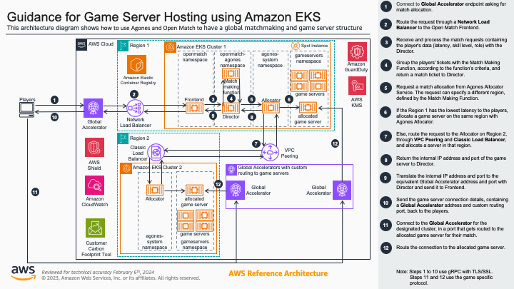

# Guidance for Game Server Hosting on Amazon EKS with Agones and Open Match


- [Introduction](#introduction)
    * [High Level Architecture](#high-level-architecture)
    * [Repository Organization](#repository-organization)
    * [Cluster bootstrapping](#cluster-bootstrapping)
    * [Open Match  - Agones integration](#open-match---agones-integration)
- [Pre-requisites](#pre-requisites)
- [Create the clusters and deploy the required components](#create-the-clusters-and-deploy-the-required-components)
- [Build and deploy the game server fleets](#build-and-deploy-the-game-server-fleets)
- [Integrate Open Match with Agones](#integrate-open-match-with-agones)
    * [Deploy Match Function and Director on the first cluster](#deploy-match-making-function-and-director-on-the-first-cluster)
    * [Test the ncat server](#test-the-ncat-server)
    * [Test with SuperTuxKart](#test-with-supertuxkart)
- [Clean Up Resources](#clean-up-resources)
- [Security recommendations](#security-recommendations)

## Introduction

This guidance provides code and instructions to create a multi Kubernetes cluster environment to host a match making and game server solution, integrating [Open Match](https://open-match.dev/site/), [Agones](https://agones.dev/site/) and [Amazon Elastic Kubernetes Service (Amazon EKS)](https://aws.amazon.com/eks/?nc1=h_ls), for a session-based multiplayer game. 

This README aims to provide a succint installation guide for the integration. For more technical information about the deployment process, customization, and troubleshooting, please see the [Details](./DETAILS.md) page.
### High Level Architecture


### Repository organization
```bash
.
├── README.md   # This file
├── DETAILS.md  # Extra documentation
├── integration # Golang code and Dockerfiles for Open Match - Agones integration
│   ├── clients 
│   │   ├── allocation-client
│   │   ├── ncat
│   │   ├── stk
│   │   └── stk-server-build
│   ├── director 
│   ├── matchfunction
│   └── ncat-server
├── manifests   # Kubernetes YAML manifests
│   └── fleets
│       ├── ncat
│       └── stk
├── scripts     # Shell scripts
└── terraform   # Terraform code
    ├── cluster
    ├── extra-cluster
    └── intra-cluster
        └── helm_values
```
### Cluster bootstrapping

The Terraform scripts create the clusters using  [Amazon EKS Blueprints for Terraform](https://aws-ia.github.io/terraform-aws-eks-blueprints). Agones and Open Match are deployed when the clusters are bootstrapped.

Certificates CA and key files required for TLS communictions are generated by [cert-manager](https://cert-manager.io), enabled in the Terraform definition as an add-on of the EKS blueprints.

The EKS Blueprints enables metrics and logging for the EKS clusters. Metrics are exported to CloudWatch to provide observability on the clusters. 

Terraform also deploys resources out of the clusters needed by the integration, such as inter-region VPC Peering, Global Accelerator and Elastic Container Registry (ECR) repositories.

### Open Match  - Agones integration

Golang code provides integration between Open Match and Agones, creating 
- a *Match Making Function* based on the latency from the client to the server endpoint
- a *Director* that handles the game server allocation between Agones *Allocator* and the game clients. 

Dockerfile and Kubernetes manifests enable container building and deploying.


## Pre-requisites
This guidance assumes that the user already has access to an AWS account and has the [AWS command line interface](https://docs.aws.amazon.com/cli/latest/userguide/getting-started-install.html) installed and configured to access the account using their credentials. **Ensure that the output option for the AWS CLI is switched to `json`.** To do so, run the command `aws configure` and modify the output option when prompted. If the AWS CLI output option is set to its default `text` output then you may encounter an error while deploying the terraform templates.


While the commands and scripts here were tested on `bash` and `zsh` shells, they can be run with some modifications in other shells, like `Windows PowerShell` or `fish`.

To deploy the infrastructure and run the examples, we need:
- [Terraform](https://developer.hashicorp.com/terraform/tutorials/aws-get-started/install-cli)
- [kubectl](https://kubernetes.io/docs/tasks/tools/#kubectl)
- [Helm](https://helm.sh/docs/intro/install/)
- [jq](https://jqlang.github.io/jq/download/)
- [gettext](https://www.drupal.org/docs/8/modules/potion/how-to-install-setup-gettext)
- [Go](https://go.dev/doc/install)
- [Docker](https://docs.docker.com/get-docker/)
- [OpenSSL](https://www.openssl.org/source/) (Some operating systems, such as MacOS, may already have this built into them.)

## Create the clusters and deploy the required components

For our example, we will be creating two EKS clusters in different regions. The first one will run our Open Match matchmaking service and the central Agones allocator, with a group of game servers for this region. The second cluster will run another Agones instance, responsible for the game servers on that region.
We will run terraform in three steps, following the `terraform` folder:

1. terraform/cluster: Creates the EKS clusters and VPCs in both regions.
2. terraform/intra-cluster: Deploys several components inside both clusters, using `helm` charts and `kubernetes` manifests.
3. terraform/extra-cluster: Creates additional AWS resources outside the cluster, like ECR repositories, VPC peering and Global Accelerator infrastructures.

### Prepare terraform environment variables
Define the names of our clusters and two different regions to run them. We can customize the clusters names, regions and VPC CIDR using the variables passed to the Terraform stack. In our examples we will be using `agones-gameservers-1` and `10.1.0.0/16` on region `us-east-1`, and `agones-gameservers-2` with `10.2.0.0/16` region `us-east-2`. Note that the CIDR of the VPCs should not overlap, since we will use VPC Peering to connect them.
```bash
CLUSTER1=agones-gameservers-1
REGION1=us-east-1
CIDR1="10.1.0.0/16"
CLUSTER2=agones-gameservers-2
REGION2=us-east-2
CIDR2="10.2.0.0/16"
VERSION="1.28"
```

For simplicity, we will be using local Terraform state files. In production workloads, we recommend storing the state files remotely, for example using the [S3 Terraform backend](https://developer.hashicorp.com/terraform/language/settings/backends/s3).


### terraform/cluster

**Select one of the options below to deploy the compute components of the EKS Clusters** By default, any Managed Node Group not specified to use arm-based instances will use x86-based instances.

#### Option 1

Run the following commands to create EKS clusters with **all x86-based instance types,** with the names and regions configured in the previous steps.
```bash
# Initialize Terraform
terraform -chdir=terraform/cluster init &&
# Create both clusters
terraform -chdir=terraform/cluster apply -auto-approve \
 -var="cluster_1_name=${CLUSTER1}" \
 -var="cluster_1_region=${REGION1}" \
 -var="cluster_1_cidr=${CIDR1}" \
 -var="cluster_2_name=${CLUSTER2}" \
 -var="cluster_2_region=${REGION2}" \
 -var="cluster_2_cidr=${CIDR2}" \
 -var="cluster_version=${VERSION}"
```


#### Option 2

Run the following commands to create EKS clusters with **all arm-based instance types.**
```
# Initialize Terraform
terraform -chdir=terraform/cluster init &&
# Create both clusters
terraform -chdir=terraform/cluster apply -auto-approve \
 -var="cluster_1_name=${CLUSTER1}" \
 -var="cluster_1_region=${REGION1}" \
 -var="cluster_1_cidr=${CIDR1}" \
 -var="cluster_2_name=${CLUSTER2}" \
 -var="cluster_2_region=${REGION2}" \
 -var="cluster_2_cidr=${CIDR2}" \
 -var="cluster_version=${VERSION}" \
 -var="all_arm_based_instances_cluster_1"=true \
 -var="all_arm_based_instances_cluster_2"=true
```


#### Option 3

Run the following commands to create EKS clusters with **a variety of x86 and arm-based instance types for each Managed Node Group.**
```
# Initialize Terraform
terraform -chdir=terraform/cluster init &&
# Create both clusters
terraform -chdir=terraform/cluster apply -auto-approve \
 -var="cluster_1_name=${CLUSTER1}" \
 -var="cluster_1_region=${REGION1}" \
 -var="cluster_1_cidr=${CIDR1}" \
 -var="cluster_2_name=${CLUSTER2}" \
 -var="cluster_2_region=${REGION2}" \
 -var="cluster_2_cidr=${CIDR2}" \
 -var="cluster_version=${VERSION}" \
 -var="gameservers_arm_based_instances_cluster_1"=true \
 -var="gameservers_arm_based_instances_cluster_2"=true \
 -var="agones_system_arm_based_instances_cluster_1"=true \
 -var="agones_system_arm_based_instances_cluster_2"=true \
 -var="agones_metrics_arm_based_instances_cluster_1"=false \
 -var="agones_metrics_arm_based_instances_cluster_2"=false
```


#### Configurable Variables in terraform/cluster creation
Currently, the following list shows all available configurable variables for creating the compute components of the EKS clusters through the `terraform -chdir=terraform/cluster apply` command:
- `cluster_1_name` (string)
- `cluster_1_region` (string)
- `cluster_1_cidr` (string)
- `cluster_2_name` (string)
- `cluster_2_region` (string)
- `cluster_2_cidr` (string)
- `cluster_version` (string)
- `all_arm_based_instances_cluster_1` (bool)
- `all_arm_based_instances_cluster_2` (bool)
- `gameservers_arm_based_instances_cluster_1` (bool)
- `gameservers_arm_based_instances_cluster_2` (bool)
- `agones_system_arm_based_instances_cluster_1` (bool)
- `agones_system_arm_based_instances_cluster_2` (bool)
- `agones_metrics_arm_based_instances_cluster_1` (bool)
- `agones_metrics_arm_based_instances_cluster_2` (bool)

Unfortunately, open match does not have an arm-based container image. Hence why the managed node groups that help run openmatch are not available for architecture configuration.

### terraform/intra-cluster
The commands below will deploy our resources inside the clusters created in the last step. We use the output values from `terraform/cluster` as input to the `terraform/intra-cluster` module.
```bash
# Initialize Terraform
terraform -chdir=terraform/intra-cluster init  &&
# Deploy to the first cluster
terraform -chdir=terraform/intra-cluster workspace select -or-create=true ${REGION1} &&
terraform -chdir=terraform/intra-cluster apply -auto-approve \
 -var="cluster_name=${CLUSTER1}" \
 -var="cluster_region=${REGION1}" \
 -var="cluster_endpoint=$(terraform -chdir=terraform/cluster output -raw cluster_1_endpoint)" \
 -var="cluster_certificate_authority_data=$(terraform -chdir=terraform/cluster output -raw cluster_1_certificate_authority_data)" \
 -var="cluster_token=$(terraform -chdir=terraform/cluster output -raw cluster_1_token)" \
 -var="cluster_version=${VERSION}" \
 -var="oidc_provider_arn=$(terraform -chdir=terraform/cluster output -raw oidc_provider_1_arn)" \
 -var="namespaces=[\"agones-openmatch\", \"agones-system\", \"gameservers\", \"open-match\"]" \
 -var="configure_agones=true" \
 -var="configure_open_match=true" &&
# Deploy to the second cluster
terraform -chdir=terraform/intra-cluster workspace select -or-create=true ${REGION2} &&
terraform -chdir=terraform/intra-cluster apply -auto-approve \
 -var="cluster_name=${CLUSTER2}" \
 -var="cluster_region=${REGION2}" \
 -var="cluster_endpoint=$(terraform -chdir=terraform/cluster output -raw cluster_2_endpoint)" \
 -var="cluster_certificate_authority_data=$(terraform -chdir=terraform/cluster output -raw cluster_2_certificate_authority_data)" \
 -var="cluster_token=$(terraform -chdir=terraform/cluster output -raw cluster_2_token)" \
 -var="cluster_version=${VERSION}" \
 -var="oidc_provider_arn=$(terraform -chdir=terraform/cluster output -raw oidc_provider_2_arn)" \
 -var="namespaces=[\"agones-system\", \"gameservers\"]" \
 -var="configure_agones=true" \
 -var="configure_open_match=false" 
```


### fetch the load balancer ARN
Run the commands below to get the ARN of the load balancer deployed in the previous step. The value will be passed as a variable to the next step.

First, set an environment variable that matches the name of the loadbalancer service. The name can be found by running the `kubectl get services -n open-match` command and looking for the only service of type LoadBalancer.
```
OPEN_MATCH_SVC_NAME=$CLUSTER1-om-fe
```
Note: If you want to rename the Open Match service then you can do so in the /scripts/configure-open-match-ingress.sh file. Also note that the dashes in the above environment variable setting command help the shell know the end of an environment variable ($CLUSTER1) and the start of a string (-om-fe). Running the command `OPEN_MATCH_SVC_NAME=$CLUSTER1omfe` will not work in setting a new environment variable that concatenates an existing environment variable with other text.

#### Ensure that your kubectl context is set to the correct context for Cluster 1 before executing the next two commands.
```bash
kubectl config use-context $(kubectl config get-contexts -o=name | grep ${CLUSTER1})
```

Next, set the name of the Load balancer:
```bash
FLB_NAME=$(kubectl get services -n open-match -o json | jq -r --arg OPEN_MATCH_SVC_NAME "$OPEN_MATCH_SVC_NAME" '.items[] | select(.metadata.name==$OPEN_MATCH_SVC_NAME) | .status.loadBalancer.ingress[0].hostname')
```
Then retrieve the ARN of the load balancer:
```bash
FLB_ARN=$( aws elbv2 describe-load-balancers --region us-east-1 | jq -r ".LoadBalancers[] | select(.DNSName==\"$FLB_NAME\") | .LoadBalancerArn")
```

### terraform/extra-cluster
Here we deploy the external components to our infrastructure, and configure resources that need both clusters to deploy, such as VPC Peering and Agones multi-cluster allocation.
```bash
# Initialize Terraform
terraform -chdir=terraform/extra-cluster init &&
# Get the values needed by Terraform
VPC1=$(terraform -chdir=terraform/cluster output -raw vpc_1_id) &&
SUBNETS1=$(terraform -chdir=terraform/cluster output gameservers_1_subnets) &&
ROUTE1=$(terraform -chdir=terraform/cluster output -raw private_route_table_1_id) &&
ENDPOINT1=$(terraform -chdir=terraform/cluster output -raw cluster_2_endpoint) &&
AUTH1=$(terraform -chdir=terraform/cluster output -raw cluster_1_certificate_authority_data) &&
TOKEN1=$(terraform -chdir=terraform/cluster output -raw cluster_1_token) &&
VPC2=$(terraform -chdir=terraform/cluster output -raw vpc_2_id) &&
SUBNETS2=$(terraform -chdir=terraform/cluster output gameservers_2_subnets) &&
ROUTE2=$(terraform -chdir=terraform/cluster output -raw private_route_table_2_id) &&
ENDPOINT2=$(terraform -chdir=terraform/cluster output -raw cluster_2_endpoint) &&
AUTH2=$(terraform -chdir=terraform/cluster output -raw cluster_2_certificate_authority_data) &&
TOKEN2=$(terraform -chdir=terraform/cluster output -raw cluster_2_token) &&
# Create resources  
terraform -chdir=terraform/extra-cluster apply -auto-approve \
 -var="cluster_1_name=${CLUSTER1}" \
 -var="requester_cidr=${CIDR1}" \
 -var="requester_vpc_id=${VPC1}" \
 -var="requester_route=${ROUTE1}" \
 -var="cluster_1_gameservers_subnets=${SUBNETS1}" \
 -var="cluster_1_endpoint=${ENDPOINT1}" \
 -var="cluster_1_certificate_authority_data=${AUTH1}" \
 -var="cluster_1_token=${TOKEN1}" \
 -var="cluster_2_name=${CLUSTER2}" \
 -var="accepter_cidr=${CIDR2}" \
 -var="accepter_vpc_id=${VPC2}" \
 -var="accepter_route=${ROUTE2}" \
 -var="cluster_2_gameservers_subnets=${SUBNETS2}" \
 -var="cluster_2_endpoint=${ENDPOINT2}" \
 -var="cluster_2_certificate_authority_data=${AUTH2}" \
 -var="cluster_2_token=${TOKEN2}" \
 -var="cluster_1_region=${REGION1}" \
 -var="ecr_region=${REGION1}" \
 -var="cluster_2_region=${REGION2}" \
 -var="aws_lb_arn=${FLB_ARN}"

```
After several minutes, Terraform should end with a mesage similar to this:
```bash
Apply complete! Resources: XX added, YY changed, ZZ destroyed.

Outputs:
global_accelerator_address = "abcdefgh123456789.awsglobalaccelerator.com"
```

Please, save the `global_accelerator_address` value, as we will use it later to connect to our game servers. In case we need to retrieve it, we can run `terraform -chdir=terraform/extra-cluster output`. 


## Build and deploy the game server fleets

We added two game servers to test the Agones and Open Match deployments: 
- ncat-server: a lightweight client-server chatroom we developed using [Ncat](https://nmap.org/ncat/) together with a Golang client to illustrate the Open Match integration.
- [SuperTuxKart](https://supertuxkart.net/Main_Page): a 3D open-source kart racing game developed in C/C++. Since we didn't change the client's code to integrate Open Match functionality, we use a Golang wrapper with the code from the ncat example.

We will use the ncat-server deployment to test the Open Match matchmaking. 

**Note: Verify that Docker is running before the next steps.**

Use one of the below commands to build the image, push it to the ECR repository, and deploy 4 fleets of ncat game servers on each cluster. 

#### X86-based nodes in the gameservers managed node group
```bash
sh scripts/deploy-ncat-fleets.sh ${CLUSTER1} ${REGION1} ${CLUSTER2} ${REGION2} amd64
```

#### arm-based nodes in the gameservers managed node group
```bash
sh scripts/deploy-ncat-fleets.sh ${CLUSTER1} ${REGION1} ${CLUSTER2} ${REGION2} arm64
```

## Integrate Open Match with Agones
This repository contains code and documentation for the customized versions of Open Match `director` and `matchfunction` on the folders [./integration/director/](./integration/director/) and [./integration/matchfunction/](./integration/matchfunction/), as well as the client tools we used in the folder [./integration/clients/](./integration/clients/). 

### Deploy Match Making Function and Director on the first cluster 
1. Switch the kubernetes context to `$CLUSTER1``
```bash
kubectl config use-context $(kubectl config get-contexts -o=name | grep ${CLUSTER1})
```

2. Build and deploy the Open Match matchmaking function
```bash
sh scripts/deploy-matchfunction.sh ${CLUSTER1} ${REGION1}
```

3. Build and deploy the Open Match Director
```bash
sh scripts/deploy-director.sh ${CLUSTER1} ${REGION1} ${REGION2}
```

4. Verify that the mmf and director pods are running
```bash
kubectl get pods -n agones-openmatch
```

### Test the ncat server
Here we test the flow of the Open Match - Agones integration. We use the ncat fleet deployment and the contents of the folder [integration/clients/ncat](integration/clients/ncat). We will need to open several terminal windows to run this test. 
**Note about the client <-> frontend communication:** In our example, we connect the client directly to the Open Match Frontend, so we need to have the TLS certificates from the frontend available to the client. In a complete game architecture, we would have a [Game Frontend](https://open-match.dev/site/docs/guides/matchmaker/frontend/) between the client and the Open Match, that would handle this communication, among other tasks like authentication, leaderboards, and lobby.

1. Go to the `integration/clients/ncat`
```bash
cd integration/clients/ncat
```
2. Get the TLS cert of the Frontend 
```bash
kubectl get secret open-match-tls-server -n open-match -o jsonpath="{.data.public\.cert}" | base64 -d > public.cert
kubectl get secret open-match-tls-server -n open-match -o jsonpath="{.data.private\.key}" | base64 -d > private.key
kubectl get secret open-match-tls-rootca -n open-match -o jsonpath="{.data.public\.cert}" | base64 -d > publicCA.cert
```
> [!TIP]
> TLS secrets should be rotated before their expiry date. Put in place a secrets rotation strategy or leverage the [TLS with AWS PCA issuer pattern](https://github.com/aws-ia/terraform-aws-eks-blueprints/tree/main/patterns/tls-with-aws-pca-issuer) to integrate CertManager with AWS Certificate Manager. 
 
3. Run the player client. Here we'll use the value of `global_accelerator_address` from the Terraform deployment. Remember to adjust our regions:
```bash
REGION1=us-east-1
REGION2=us-east-2
export GOPROXY=direct
go run main.go -frontend <global_accelerator_address>:50504 -region1 $REGION1 -latencyRegion1 10 -region2 $REGION2 -latencyRegion2 30
```

>YYYY/MM/DD hh:mm:ss Connecting to Open Match Frontend
YYYY/MM/DD hh:mm:ss Ticket ID: cdfu6mqgqm6kj18qr880
YYYY/MM/DD hh:mm:ss Waiting for ticket assignment

4. In three other terminal windows, type the commands from the steps **(1.)** and **(3.)** above. When the fourth client is started, we should have a similar output to the sample below, showing the connection to the Frontend server, the game server assigned to the client and the connection to the game server:
>YYYY/MM/DD hh:mm:ss Connecting to Open Match Frontend
YYYY/MM/DD hh:mm:ss Ticket ID: cdfu6mqgqm6kj18qr880
YYYY/MM/DD hh:mm:ss Waiting for ticket assignment  
YYYY/MM/DD hh:mm:ss Ticket assignment: connection:"xxxxxxxxxxxxxxxxx.awsglobalaccelerator.com:yyyyy"
YYYY/MM/DD hh:mm:ss Disconnecting from Open Match Frontend
YYYY/MM/DD hh:mm:ss Connecting to ncat server
<announce> 201.17.120.226 is connected as <user5>.
<announce> already connected: nobody.
<announce> 201.17.120.226 is connected as <user6>.
<announce> already connected: 201.17.120.226 as <user5>.
<announce> 201.17.120.226 is connected as <user7>.
<announce> already connected: 201.17.120.226 as <user5>, 201.17.120.226 as <user6>.
<announce> 201.17.120.226 is connected as <user8>.
<announce> already connected: 201.17.120.226 as <user5>, 201.17.120.226 as <user6>, 201.17.120.226 as <user7>.

5. In another terminal window, verify the game servers. Let the command running with the `-w` flag to detect state changes. We should see one server in the `Allocated` state, and the others in the `Ready` state.
```bash
kubectl get gs -n gameservers -w
```

6. In the terminal windows running the clients, type anything and press enter. We should see the messages replicated to the other client windows.

7. Press `CTRL-C` in all the client windows. This should close the clients. When the last one closes, switch to the window with the `kubectl get gs -w` command. It should show that the allocated server is shutting down (since all the players disconnected) and a new game server is being provisioned.

8. We can repeat the process with different values to the `-latencyRegion1` and `-latencyRegion2` flags when calling the client, to verify how it affects the game server allocation. Remember to stop the client with `CTRL-C`, adjust the kubectl context to the cluster with the lowest latency, using the command 
```bash
kubectl config use-context $(kubectl config get-contexts -o=name | grep ${CLUSTER1})
``` 
or 
```bash
kubectl config use-context $(kubectl config get-contexts -o=name | grep ${CLUSTER2})
```
and run 
```bash
kubectl get gs -n gameservers -w
```
again, before starting the clients with new values.

### Test with SuperTuxKart
We can use the fleets in the [fleets/stk/](fleets/stk/) folder and the client in [integration/clients/stk/](integration/clients/stk/) to test the SuperTuxKart integration with Open Match and Agones, similarly to our ncat example above. Please, refer to the [README.md](integration/clients/stk/README.md) in the stk folder for more instructions.

## Automated Deployment with CloudFormation

In addition to the manual deployment steps outlined above, this solution includes a CloudFormation template that automates the entire deployment process through AWS CodePipeline and CodeBuild. This approach eliminates the need to manually run Terraform commands and simplifies the deployment of the multi-cluster game server hosting environment.

### CloudFormation Deployment Architecture

The CloudFormation template creates a complete CI/CD pipeline that handles the deployment of all components:

The automated deployment includes:
- **AWS CodePipeline**: Orchestrates the deployment workflow
- **AWS CodeBuild**: Executes the Terraform scripts in the correct sequence
- **S3 Buckets**: Store Terraform state and deployment artifacts
- **DynamoDB Table**: Manages Terraform state locking
- **IAM Roles**: Provides necessary permissions for the deployment process

The pipeline follows the same deployment steps as the manual process:
1. Creates EKS clusters in both regions
2. Deploys Agones and Open Match components within the clusters
3. Sets up cross-region networking and Global Accelerator
4. Deploys game server fleets and integration components

### Deploying with CloudFormation

To deploy using the CloudFormation template:

1. Sign in to the AWS Management Console and navigate to the CloudFormation service
2. Choose "Create stack" > "With new resources (standard)"
3. Select "Upload a template file" and upload the `terraform/cloudformation/main.yaml` file
4. Enter a stack name (e.g., "agones-openmatch-deployment")
5. Configure the required parameters:

| Parameter | Description | Default |
|-----------|-------------|---------|
| CodeStarConnectionArn | ARN of the CodeStar connection to GitHub (required) | - |
| RepositoryOwner | Owner of the GitHub repository (required) | - |
| RepositoryLocation | URL of the GitHub repository (required) | - |
| AdminRoleArn | ARN of the admin role (required) | - |
| Cluster1Name | Name for the first EKS cluster | agones-gameservers-1 |
| Cluster1Region | AWS region for the first cluster | us-east-1 |
| Cluster1CIDR | CIDR block for the first cluster's VPC | 10.1.0.0/16 |
| Cluster2Name | Name for the second EKS cluster | agones-gameservers-2 |
| Cluster2Region | AWS region for the second cluster | us-east-2 |
| Cluster2CIDR | CIDR block for the second cluster's VPC | 10.2.0.0/16 |
| KubernetesVersion | Kubernetes version for the EKS clusters | 1.28 |

6. Review the configuration and acknowledge that CloudFormation might create IAM resources
7. Choose "Create stack"

> **Note:** Before deploying, you must create a CodeStar connection to GitHub. To do this:
> 1. Navigate to the AWS Developer Tools console
> 2. Select "Settings" > "Connections" > "Create connection"
> 3. Choose GitHub as the provider and follow the prompts to authorize AWS to access your GitHub account
> 4. Once the connection is created, use its ARN for the `CodeStarConnectionArn` parameter

### Monitoring the Deployment

The deployment process takes approximately 30-45 minutes to complete. You can monitor the progress:

1. In the CloudFormation console, select your stack and view the "Events" tab
2. In the CodePipeline console, select the pipeline created by CloudFormation to see detailed progress
3. In the CodeBuild console, you can view the build logs for detailed information about each step

### Accessing Deployment Outputs

Once the deployment is complete:

1. Navigate to the AWS CloudFormation console
2. Select your stack and go to the "Outputs" tab
3. Look for the Global Accelerator address that will be used to connect to your game servers

You can also find this information in the CodeBuild logs, which will display the Terraform outputs at the end of the build process.

## Clean Up Resources
Note: If you run the below command in a new terminal that no longer retains the necessary environment variables from previous commands then please reset the necessary environment variables by running 1) the initial environment variable-setting command for cluster name, cluster version, etc. at the beginning of this walkthrough, and 2) run the environment variable-setting commands present in the terraform/extra-cluster create command.

- Destroy the extra clusters components
    ```bash
    terraform -chdir=terraform/extra-cluster destroy -auto-approve \
     -var="requester_cidr=${CIDR1}" \
     -var="requester_vpc_id=${VPC1}" \
     -var="requester_route=${ROUTE1}" \
     -var="cluster_1_name=${CLUSTER1}" \
     -var="cluster_1_gameservers_subnets=${SUBNETS1}" \
     -var="cluster_1_endpoint=${ENDPOINT1}" \
     -var="cluster_1_certificate_authority_data=${AUTH1}" \
     -var="cluster_1_token=${TOKEN1}" \
     -var="cluster_2_name=${CLUSTER2}" \
     -var="accepter_cidr=${CIDR2}" \
     -var="accepter_vpc_id=${VPC2}" \
     -var="accepter_route=${ROUTE2}" \
     -var="cluster_2_gameservers_subnets=${SUBNETS2}" \
     -var="cluster_2_endpoint=${ENDPOINT2}" \
     -var="cluster_2_certificate_authority_data=${AUTH2}" \
     -var="cluster_2_token=${TOKEN2}" \
     -var="cluster_1_region=${REGION1}" \
     -var="ecr_region=${REGION1}" \
     -var="cluster_2_region=${REGION2}" \
     -var="aws_lb_arn=${FLB_ARN}"
    ``` 

- Delete the Load Balancers and Security Groups
    ```bash
    aws elbv2 delete-load-balancer --region ${REGION1} --load-balancer-arn $(aws elbv2 describe-load-balancers --region ${REGION1} --query "LoadBalancers[?contains(LoadBalancerName,'${CLUSTER1}-om-fe')].LoadBalancerArn"  --output text)
    aws elbv2 delete-load-balancer --region ${REGION1} --load-balancer-arn $(aws elbv2 describe-load-balancers --region ${REGION1} --query "LoadBalancers[?contains(LoadBalancerName,'${CLUSTER1}-allocator')].LoadBalancerArn"  --output text)
    aws elbv2 delete-load-balancer --region ${REGION1} --load-balancer-arn $(aws elbv2 describe-load-balancers --region ${REGION1} --query "LoadBalancers[?contains(LoadBalancerName,'${CLUSTER1}-ping-http')].LoadBalancerArn"  --output text)
    aws elbv2 delete-load-balancer --region ${REGION1} --load-balancer-arn $(aws elbv2 describe-load-balancers --region ${REGION1} --query "LoadBalancers[?contains(LoadBalancerName,'${CLUSTER1}-ping-udp')].LoadBalancerArn"  --output text)
    aws elbv2 delete-load-balancer --region ${REGION2} --load-balancer-arn $(aws elbv2 describe-load-balancers --region ${REGION2} --query "LoadBalancers[?contains(LoadBalancerName,'${CLUSTER2}-allocator')].LoadBalancerArn"  --output text)
    aws elbv2 delete-load-balancer --region ${REGION2} --load-balancer-arn $(aws elbv2 describe-load-balancers --region ${REGION2} --query "LoadBalancers[?contains(LoadBalancerName,'${CLUSTER2}-ping-http')].LoadBalancerArn"  --output text)
    aws elbv2 delete-load-balancer --region ${REGION2} --load-balancer-arn $(aws elbv2 describe-load-balancers --region ${REGION2} --query "LoadBalancers[?contains(LoadBalancerName,'${CLUSTER2}-ping-udp')].LoadBalancerArn"  --output text)
    ```

- Discard or destroy the internal cluster components
    If we are removing all the components of the solution, it's quicker to simply discard the Terraform state of the intra-cluster folder, since we will destroy the clusters in the next step, and this will automatically remove the intra-cluster components. 
    ```bash
    terraform -chdir=terraform/intra-cluster workspace select ${REGION1}
    terraform -chdir=terraform/intra-cluster state list | cut -f 1 -d '[' | xargs -L 0 terraform -chdir=terraform/intra-cluster state rm
    terraform -chdir=terraform/intra-cluster workspace select ${REGION2}
    terraform -chdir=terraform/intra-cluster state list | cut -f 1 -d '[' | xargs -L 0 terraform -chdir=terraform/intra-cluster state rm
    ``` 
    If we prefer to destroy the components in this stage (for example, to keep the clusters created by terraform/cluster and test terraform-intra clusters with other values and configurations), use the code below instead.

    ```bash

    # Destroy the resources inside the first cluster
    terraform -chdir=terraform/intra-cluster workspace select ${REGION1}
    terraform -chdir=terraform/intra-cluster destroy -auto-approve \
    -var="cluster_name=${CLUSTER1}" \
    -var="cluster_region=${REGION1}" \
    -var="cluster_endpoint=$(terraform -chdir=terraform/cluster output -raw cluster_1_endpoint)" \
    -var="cluster_certificate_authority_data=$(terraform -chdir=terraform/cluster output -raw cluster_1_certificate_authority_data)" \
    -var="cluster_token=$(terraform -chdir=terraform/cluster output -raw cluster_1_token)" \
    -var="cluster_version=${VERSION}" \
    -var="oidc_provider_arn=$(terraform -chdir=terraform/cluster output -raw oidc_provider_1_arn)" \
    -var="namespaces=[\"agones-openmatch\", \"agones-system\", \"gameservers\", \"open-match\"]" \
    -var="configure_agones=true" \
    -var="configure_open_match=true"

    # Destroy the resources inside the second cluster
    terraform -chdir=terraform/cluster workspace select ${REGION2}
    terraform -chdir=terraform/intra-cluster workspace select ${REGION2}
    terraform -chdir=terraform/intra-cluster destroy -auto-approve \
    -var="cluster_name=${CLUSTER2}" \
    -var="cluster_region=${REGION2}" \
    -var="cluster_endpoint=$(terraform -chdir=terraform/cluster output -raw cluster_2_endpoint)" \
    -var="cluster_certificate_authority_data=$(terraform -chdir=terraform/cluster output -raw cluster_2_certificate_authority_data)" \
    -var="cluster_token=$(terraform -chdir=terraform/cluster output -raw cluster_2_token)" \
    -var="cluster_version=${VERSION}" \
    -var="oidc_provider_arn=$(terraform -chdir=terraform/cluster output -raw oidc_provider_2_arn)" \
    -var="namespaces=[\"agones-system\", \"gameservers\"]" \
    -var="configure_agones=true" \
    -var="configure_open_match=false" 
    ``` 
- Destroy the clusters
    ```bash
    # Destroy both clusters
    terraform -chdir=terraform/cluster destroy -auto-approve \
    -var="cluster_1_name=${CLUSTER1}" \
    -var="cluster_1_region=${REGION1}" \
    -var="cluster_1_cidr=${CIDR1}" \
    -var="cluster_2_name=${CLUSTER2}" \
    -var="cluster_2_region=${REGION2}" \
    -var="cluster_2_cidr=${CIDR2}" \
    -var="cluster_version=${VERSION}"
    ``` 
    **Note:** if the `terraform destroy` command fails to destroy the subnets or the VPCs, run the commands
    ```bash
    for sg in $(aws ec2 describe-security-groups --region ${REGION1} --filters "Name=vpc-id,Values=$(aws ec2  describe-vpcs --region ${REGION1} --filters "Name=tag:Name,Values='${CLUSTER1}'" --query Vpcs[].VpcId --output text)" --query SecurityGroups[].GroupId --output text); do aws ec2 delete-security-group --region ${REGION1} --group-id $sg ; done
    for sg in $(aws ec2 describe-security-groups --region ${REGION2} --filters "Name=vpc-id,Values=$(aws ec2  describe-vpcs --region ${REGION2} --filters "Name=tag:Name,Values='${CLUSTER2}'" --query Vpcs[].VpcId --output text)" --query SecurityGroups[].GroupId --output text); do aws ec2 delete-security-group --region ${REGION2} --group-id $sg ; done
    ```
    and run the `terraform destroy` command again.


- Remove the clusters from kubectl config
    ```bash
    kubectl config delete-context $(kubectl config get-contexts -o=name | grep ${CLUSTER1})
    kubectl config delete-context $(kubectl config get-contexts -o=name | grep ${CLUSTER2})
    ```
- Remove the local certificate files
    ```bash
    rm -f *.crt *.key integration/clients/stk/*.cert integration/clients/stk/*.key integration/clients/ncat/*.cert integration/clients/ncat/*.key
    ```

# Security recommendations
[This page](./security.md) provides suggestions of actions that should be taken to make the solution more secure acording to AWS best practices.
