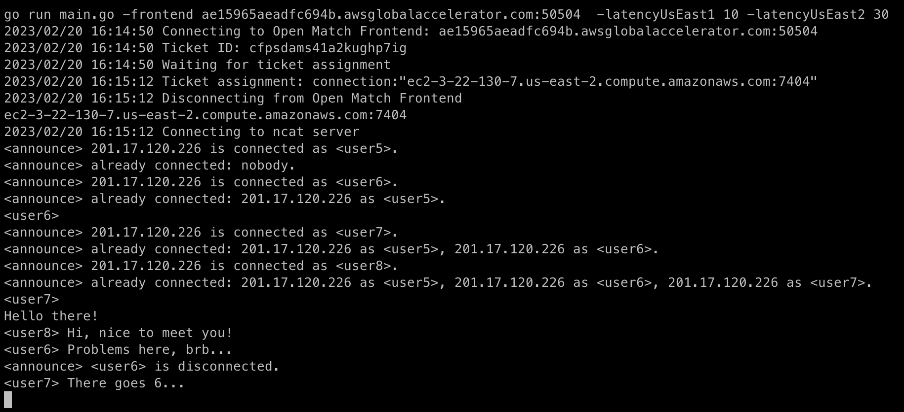

# ncat client

This code implements a simple chat client that communicates with the [ncat-server](../../ncat-server/) game servers deployed to our clusters. It calls the [allocation](../allocation-client/) module that handles the communication with the Frontend, connects to the game server address returned, and runs a loop to exchange messages with the other clients connected to the ncat-server. 
```bash
Usage:
player -frontend FrontendAddress:Port -latencyRegion1 int -latencyRegion2 int
  -frontend string
    	Open Match Frontend Endpoint (default "localhost:50504")
  -latencyRegion1 int
    	Latency to region 1 (default 100)
  -latencyRegion2 int
    	Latency to region 2 (default 100)
```
*Sample screen*

Note: this code uses TLS to connect to the Open Match Frontend, it expects the files `public.cert`, `publicCA.cert`, and `private.key` in the same directory. Refer to the main [README.md](../../../README.md#test-the-ncat-server) for instructions on how to create the TLS files.